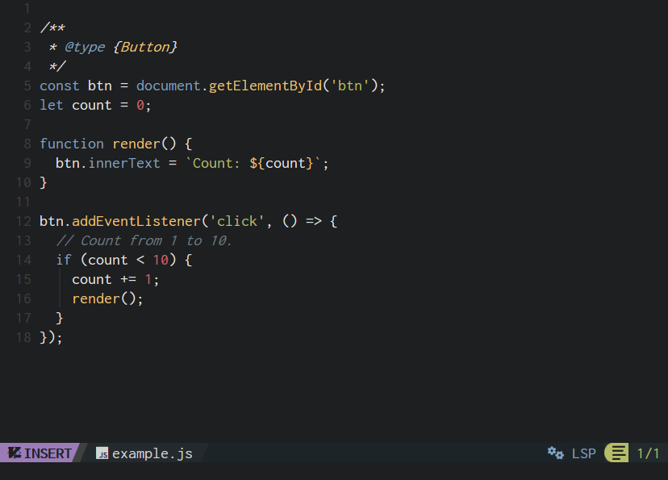

# neovim-hybrid-theme

## Theme for neovim, base46 compatible

This is essentially just a port of [vim-hybrid-vscode-theme](https://github.com/sjarvie/vim-hybrid-vscode-theme) to neovim. All credit for creating this awesome theme goes to [sjarvie](https://github.com/sjarvie).

## How to use

This theme is developed for [NvChad](https://nvchad.com/) framework, but you can probably use it without it as well.

To install the theme, copy the `themes` folder into your local `/nvim/lua` directory where Neovim is installed.
If you have `NvChad` or `base46` installed, the theme should be available automatically - press `<leader>+th` to open the theme switcher and select "**neovim-hybrid**".

### Work in progress

This theme is a work in progress. Neovim's treesitter has fewer tokens that can be customized, and it's a bit difficult to set styles per language (vim beginner here 😅). So, this port is a rough approximation of the original theme. My goal is to make it somewhat usable with the following programming and markup languages (in priority order):

[ ] - javascript/typescript (WIP)

[ ] - lua

[ ] - sql

[ ] - css, scss, less

[ ] - xml, html

### Examples

#### JavaScript

## Vim-Hybrid description

A dark colour scheme inspired by Vim-Hybrid that combines the:

- Default palette from Tomorrow-Night.
- Reduced contrast palette from Codecademy's online editor.
- Syntax group highlighting scheme from Jellybeans
- Vimscript from Solarized
